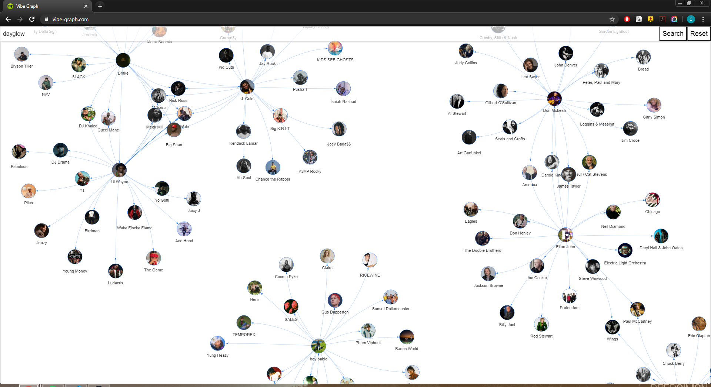

# Vibe Graph

[](https://app.circleci.com/pipelines/github/cjdellomes/vibe-graph)
[](https://codecov.io/gh/cjdellomes/vibe-graph)

Web app for visualizing the network graph of Spotify related artists. Try it out at [vibe-graph.com](https://www.vibe-graph.com)



## Usage

Enter the name of an artist into the text box at the top (e.g. "The Beatles") and click the search button. The first artist found in the search result and their related artists (i.e. similar artists) will appear as nodes and edges. Clicking on a node expands the graph by generating that artist's related artists. If a related artist's node is already generated, then just the connecting edge will be generated.

You can search for multiple artists and reset the graph to a blank slate at any time. Nodes can be dragged around to shift the graph.

## Cloning and Installing

You'll need [Node](https://nodejs.org/en/) and [Git](https://git-scm.com/) installed on your machine. Optionally, install and run a [Redis](https://redis.io/) instance to use as a cache.

To use the app locally, first clone the repo

```bash
git clone https://github.com/cjdellomes/vibe-graph/
```

Next, you'll need to create an app from your Spotify [dashboard](https://developer.spotify.com/dashboard/) in order to get the necessary credentials to use the Spotify API.

Once the app is created in the Spotify dashboard, create a `config.js` file in the `/vibe-graph/` directory. Place the client ID and client secret provided by Spotify in a module exported object. The `config.js` file should be exactly as below, but with the Xs replaced with your credentials.

```js
const config = {
  development: {
    clientID: 'XXXXXXXXXX',
    clientSecret: 'XXXXXXXXXXXX',
  },
};

module.exports = config;
```

Now, use node to install the necessary packages and build the app.

```bash
npm install
npm run build
```

## Running and Development

Either start the app and navigate to [localhost:3001](http://localhost:3001/)

```bash
npm run start
```

or run it in development mode (refreshes on changes to the code) and navigate to [localhost:3000](http://localhost:3000/)

```bash
npm run dev
```

Run tests and generate code coverage reports

```bash
npm run test
npm run coverage
```

## Credits

All the artist and related artist data comes from the [Spotify Web API](https://developer.spotify.com/documentation/web-api/).

The frontend was built using [React](https://reactjs.org/) while the backend was created with [Express](https://expressjs.com/).

The graph is rendered using [vis.js](http://visjs.org) and, more sepcifically, the [react-graph-vis](https://www.npmjs.com/package/react-graph-vis) npm package.

Partially inspired by the [Wikipedia Map](https://github.com/controversial/wikipedia-map) project by [Luke Deen Taylor](https://luke.deentaylor.com/#).
